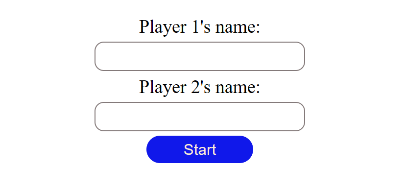
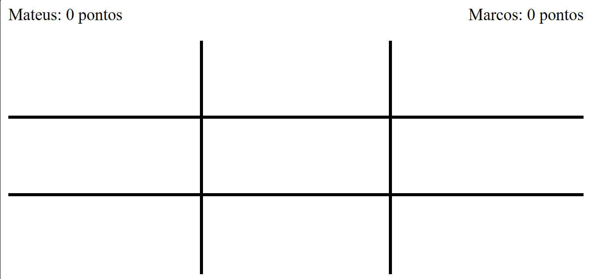
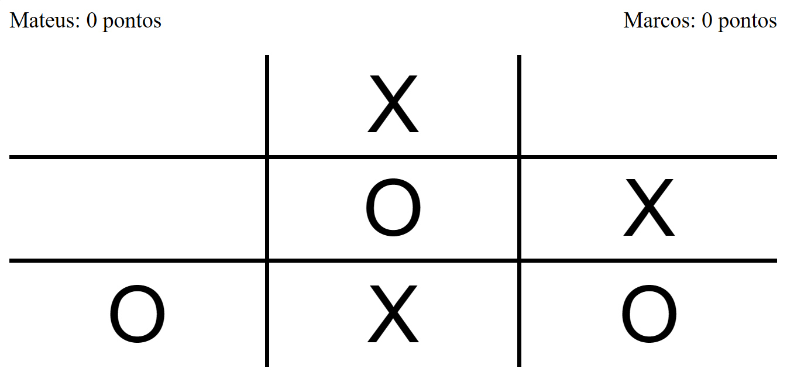
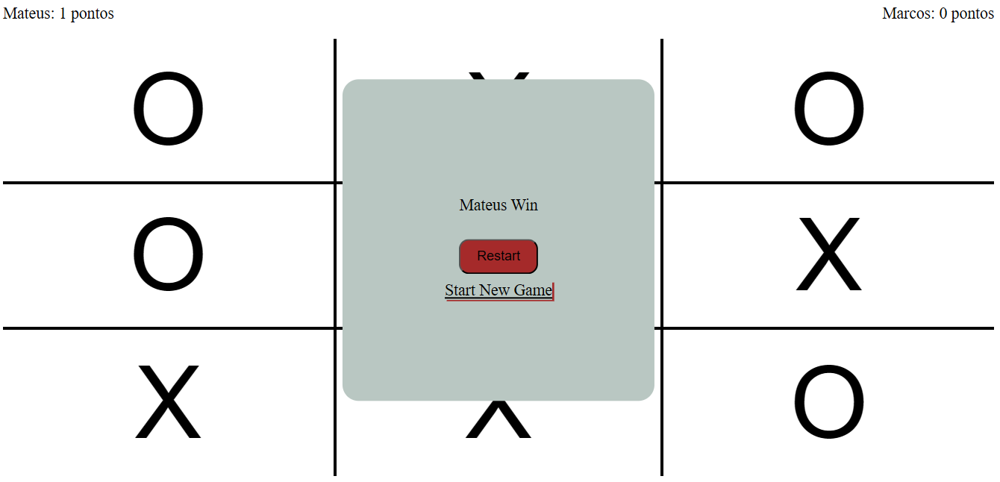
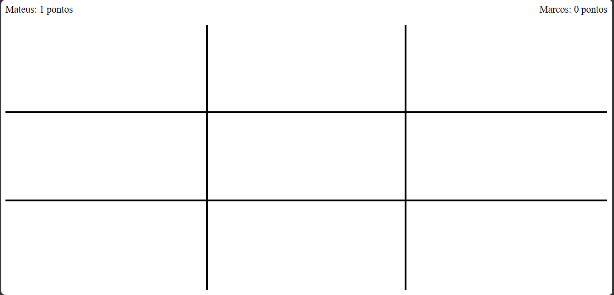

# tic-tac-toe
Tic Tac Toe Game

Funcôes:

- Inserir nome de jogadores
- Contagem de pontuação
- Recomeçar um novo jogo

Tela de input para inserir nomes dos jogadores

Tela do jogo em branco

Tela mostrando o começo de um partida

Tela de Gameover com empare

Tela de Gameover quando um jogador ganha

Tela de um novo jogo com a pontuação alterada
